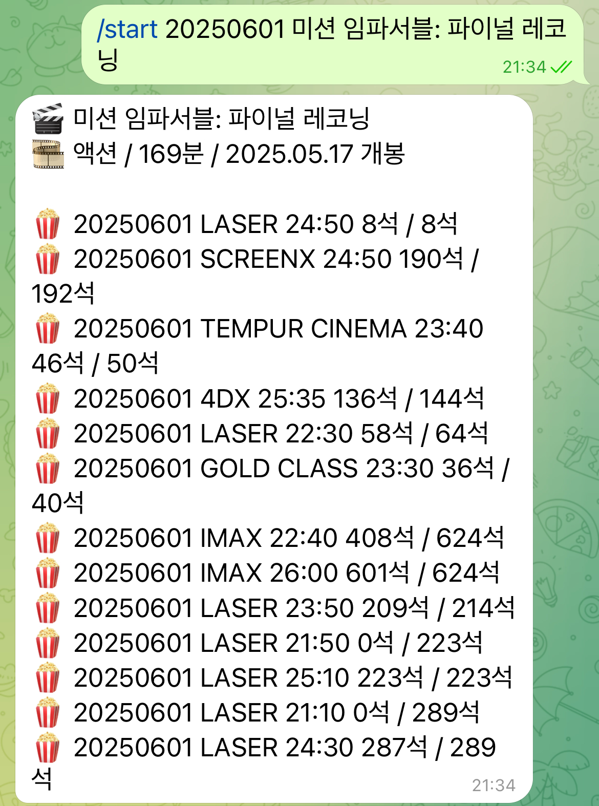

# 🎬 cgv-bot

A telegram chatbot that automates interaction with CGV Yongsan, which has the largest IMAX screen in South Korea.
It checks seat availability based on your selected date and movie, and displays the number of remaining seats along with movie schedule.
I made this bot for myself to book the best seat of IMAX and watch Mission: Impossible - The Final Reckoning.

## 🍿 Features

- 🎟️ Check current and upcoming movie showtimes periodically
- 🔍 Search by movie title
- 🔔 Send reminders for upcoming shows

<p align='center'>
    
</p>

## 📁 Project Structure

```
cgv-bot
├── config
│ └── settings.py
├── handler
│ ├── start_handler.py
│ ├── status_handler.py
│ └── stop_handler.py
├── main.py
├── models
│ ├── __init__.py
│ ├── movie.py
│ ├── showtime.py
│ └── theater.py
├── README.md
└── requirements.txt
```

## 🖥️ Telegram commands

- `/start [date] [movie title]` Start the bot
- `/stop` Stop the bot
- `/status` Display the bot status

## 🚀 Getting Started

### Cloning the repository

```bash
git clone https://github.com/navytuner/cgv-bot.git
cd cgv-bot
```

### Setting up environment & Installation

```bash
python3 -m venv .venv
source .venv/bin/activate
pip install -r requirements.txt
```

### Run the bot

```bash
python main.py
```
